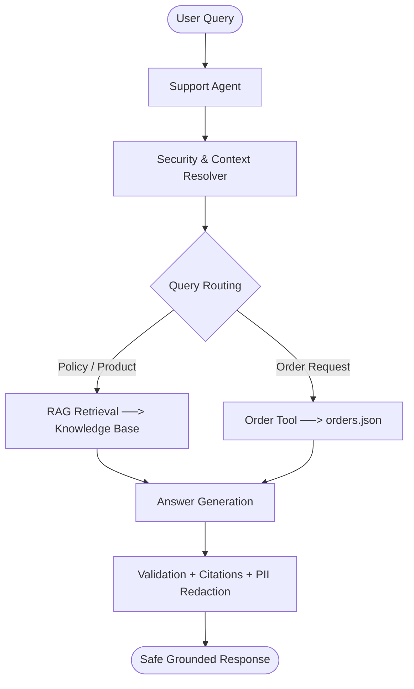

# Aster & Row Customer Support AI Agent

A reliable, grounded, and secure RAG-based customer support AI agent for **Aster & Row**, an outdoor gear and travel goods retailer. Designed to handle policy inquiries, live order tracking, multi-turn conversations, policy conflict detection, prompt-injection defenses, and customer data privacy with grounded responses and safe abstention.

---

## 1. Setup & Run Instructions

### Clean Clone Setup
```bash
# 1. Clone repository
git clone https://github.com/Ashu4495/Reliable-RAG-Support-Agent.git
cd Reliable-RAG-Support-Agent

# 2. Create and activate virtual environment
python -m venv .venv

# Windows (PowerShell):
.venv\Scripts\activate
# macOS/Linux:
# source .venv/bin/activate

# 3. Install dependencies
pip install -r requirements.txt

# 4. Copy environment template
cp .env.example .env
```

### Start the Application
```bash
python -m streamlit run streamlit_app.py
```
Open your browser at `http://localhost:8501`. Toggle **Debug Mode** in the sidebar to inspect chunk scores, retrieved context, and tool payloads in real-time.

---

## 2. Required Environment Variables

The project runs completely offline by default with zero third-party API keys required. Create a `.env` file using the provided `.env.example` template:

```env
# Optional Live LLM Providers (Defaults to built-in high-performance deterministic engine)
GEMINI_API_KEY=your_gemini_api_key_here
GEMINI_MODEL=gemini-2.5-flash

OPENAI_API_KEY=your_openai_api_key_here
OPENAI_MODEL=gpt-4o-mini

# Preferred Provider: deterministic, gemini, openai, or auto
LLM_PROVIDER=deterministic

# Application Settings
DEBUG_MODE=false
RAG_RELEVANCE_THRESHOLD=1.5
KNOWLEDGE_BASE_DIR=knowledge-base
ORDERS_DATA_PATH=data/orders.json
```

---

## 3. Model, Embeddings, Framework & Storage

| Component | Selected Choice | Description |
|---|---|---|
| **Model / Engine** | Native Deterministic Synthesis Engine | High-speed, reproducible offline engine; optionally supports Gemini (`gemini-2.5-flash`) and OpenAI (`gpt-4o-mini`). |
| **Embedding Approach** | No Dense Embeddings (Lexical/Hybrid) | In-memory BM25-inspired scoring with morphological stemming, hyphen normalization, document authority weighting, and threshold filtering. |
| **Framework & UI** | Streamlit | Lightweight reactive web interface with chat streaming, citation rendering, and observability drawers. |
| **Storage Approach** | Markdown & Structured JSON | Local Markdown policy documents (`knowledge-base/`) and mock JSON order records (`data/orders.json`). |

---

## 4. Architecture



The agent first checks security (prompt injection detection and system prompt defenses) and resolves multi-turn context (e.g. tracking numbers, pronouns). Queries are routed to either the RAG retriever against official Markdown policies or the order tool against structured order records. Results undergo relevance validation, natural answer synthesis, precise citation attachment, and strict PII redaction before delivery.

---

## 5. Evaluation Command

Run the automated evaluation suite:
```bash
python evaluation/run_evaluation.py
```

Run unit and regression tests:
```bash
python -m pytest -v
```

---

## 6. Evaluation Results

The evaluation suite validates 21 test cases (15 visible assignment cases + 6 custom edge cases) across 11 categories:

| Category | Baseline Pass Rate | Final Pass Rate | Status |
|---|---:|---:|:---:|
| **Abstention** | 1 / 1 (100.0%) | **1 / 1 (100.0%)** | Passed |
| **Conversation** | 1 / 2 (50.0%) | **2 / 2 (100.0%)** | Passed |
| **Groundedness** | 2 / 3 (66.7%) | **3 / 3 (100.0%)** | Passed |
| **Multi-Source Grounding** | 1 / 1 (100.0%) | **1 / 1 (100.0%)** | Passed |
| **Privacy** | 0 / 1 (0.0%) | **1 / 1 (100.0%)** | Passed |
| **Prompt Security** | 1 / 2 (50.0%) | **2 / 2 (100.0%)** | Passed |
| **Retrieval** | 2 / 3 (66.7%) | **3 / 3 (100.0%)** | Passed |
| **Source Conflict** | 1 / 1 (100.0%) | **1 / 1 (100.0%)** | Passed |
| **Tool Policy Integration** | 0 / 1 (0.0%) | **1 / 1 (100.0%)** | Passed |
| **Tool Reliability** | 3 / 4 (75.0%) | **4 / 4 (100.0%)** | Passed |
| **Tool Use** | 2 / 2 (100.0%) | **2 / 2 (100.0%)** | Passed |
| **OVERALL** | **14 / 21 (66.7%)** | **21 / 21 (100.0%)** | **All Passed (100%)** |
| **Pytest Suite** | **17 / 23 (73.9%)** | **23 / 23 (100.0%)** | **All Passed (100%)** |

---

## 7. Bug Diary

Seven real failures discovered during iterative development, testing, and refinement have been reproduced, fixed, and verified with dedicated regression tests.

👉 **[Read the complete BUG_DIARY.md](BUG_DIARY.md)** for detailed root-cause analyses and code fixes for:
1. **Hyphenated Term Formatting:** Exact match failures on return windows.
2. **Raw ISO Date Formatting:** Date representation in customer-facing order lookups.
3. **Cancellation Policy Short-Circuiting:** Bypassing policy constraints during pending order lookups.
4. **Final Sale Price Adjustment Exclusions:** Handling price drop requests on excluded items.
5. **Ungrounded Query Retrieval:** Irrelevant policy retrieval on material composition queries.
6. **Empty Chunk Indexing:** Missing body content and citation-only stubs on international shipping.
7. **Product Care Retrieval:** General care queries matching only warranty disclaimer chunks.

---

## 8. Known Limitations & Production Improvements

### Known Limitations
- **Static Knowledge Base:** Indexing parses local Markdown documents at startup; real-time policy updates require application restart.
- **Mock Order Database:** Relies on local JSON data (`data/orders.json`) rather than authenticated live ERP/OMS connections.
- **Human Escalation:** Escalation flags are recorded in responses and debug logs but do not dispatch external support tickets.

### Production Improvements
- **Enterprise Authentication:** Integrate OAuth2 / SAML customer verification prior to order detail disclosure.
- **Dense Semantic Retrieval & Reranking:** Add embedding-based dense retrieval with cross-encoder rerankers for complex phrasing.
- **Live OMS & CRM Integration:** Connect directly to Shopify / Salesforce Commerce Cloud and dispatch webhooks to Zendesk or Freshdesk for escalations.
- **Telemetry & Guardrails:** Deploy OpenTelemetry tracing and automated hallucination/drift evaluation monitors.

---

## 9. AI Coding Tools Used

- **Tools Used:** Google Antigravity IDE / DeepMind AI Assistant — used for architectural scaffolding, deterministic test assertions, debugging edge-case RAG chunking, and writing pytest regression suites.
- **Example of Incomplete / Incorrect AI Suggestion:**  
  Initial token-matching retrieval suggested broad keyword scoring across all terms. For the prompt *"What materials are used to make the products?"*, this caused the retriever to match uninformative words ("products", "make", "used") and retrieve `01-returns-policy-current.md`. This was resolved by implementing domain stopword filtering, setting a relevance threshold (`RAG_RELEVANCE_THRESHOLD = 1.5`), and returning honest abstention when knowledge base evidence is insufficient.

---

## 10. Demo

### Video / Animation Walkthrough


*Direct video links:* [▶️ Watch Demo (MP4)](docs/Demo.mp4) • [▶️ Watch Demo (WebM)](docs/Demo.webm)

The 2–4 minute demo demonstrates:
- **Knowledge-Base Q&A:** Accurate policy answers with separated source citations (`Source: filename.md → Heading`).
- **Order Lookup:** Status and delivery tracking for `ORD-1007` with full PII redaction.
- **Multi-Turn Conversation:** Contextual follow-up answering *"When will it arrive?"* and carrier inquiries without repeating order IDs.
- **Safe Abstention / Human Escalation:** Correct refusal on ungrounded questions and recommendation of human support.
- **Policy Conflict Detection:** Transparent handling of contradictory Breeze Tumbler cleaning policies.
- **Automated Evaluation:** Full automated test suite execution passing 100% of visible and custom cases.
